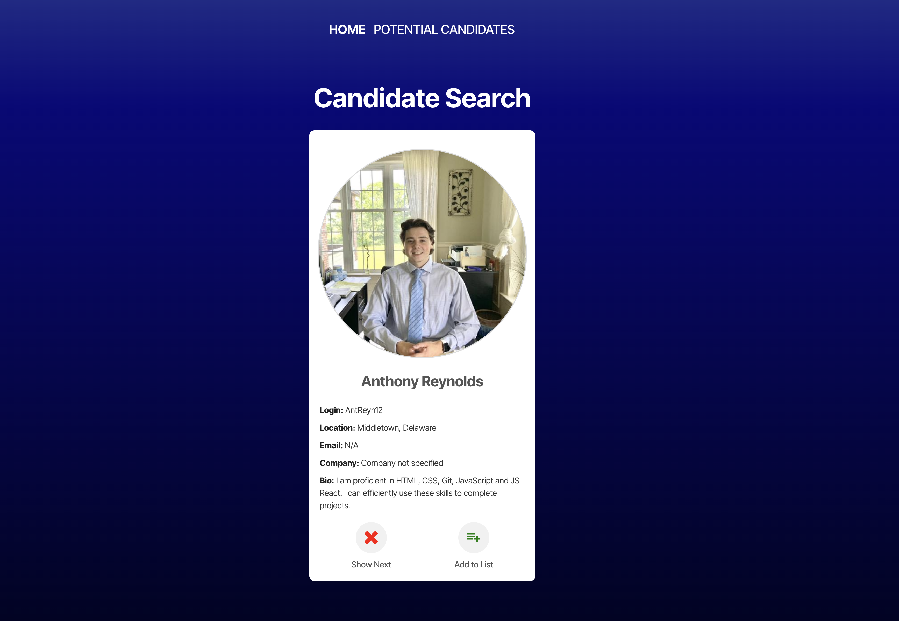
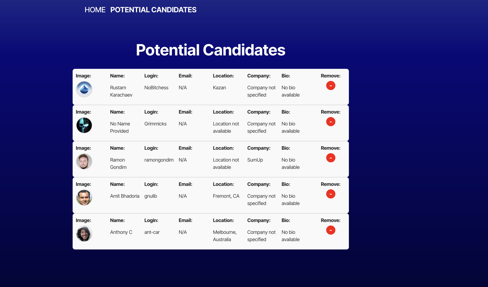

# Candidate Search

## Description

This application was created in order to query the Github API and then to display and store Github users for a Human Resources team where a hiring manager would want to hire a developer off of Github.  On page load, you click yes or no on each developer to store them to the potential candidates list.  It was created using React, Vite, Node.js, TypeScript and the Github API.  The potential candidates are stored in local storage.  

## Table of Contents
- [Installation](#installation)
- [Usage](#usage)
- [License](#license)
- [Contributing](#contributing)
- [Tests](#tests)
- [Questions](#questions)

## Installation

After downloading or cloning this repo, make sure you have Node installed and run ``npm install`` to download all needed pacakges.  Compile the Typescript and run Vite, but running ``npm run build``.  

## Usage

Begin by running ``npm run dev`` in the command line and then go to localhost:5173 in your browswer.  

From there you will see your first randomly chosen candidate.  Hit the X to decline to add the candidate to the potential list.  The page will refresh with a new candidate.  Or, hit the button to add the candidate to your list of potential candidates.  The page will refresh with a new candidate.  Continue adding or declining as desired.  Then go to the Potential Candidates page to view your candidates and remove them as desired.    

## License

MIT License

The license for this application is MIT License.

https://opensource.org/license/MIT

## Contributing

Contributors: 

Caryn Carter https://github.com/Caryndcarter 

To contribute, contact carter.caryn@gmail.com.

## Tests

Tests for this application have not been written at this time.  When they are written, they will be added in this section.  

## Questions

For questions visit https://github.com/caryndcarter or write to carter.caryn@gmail.com.

